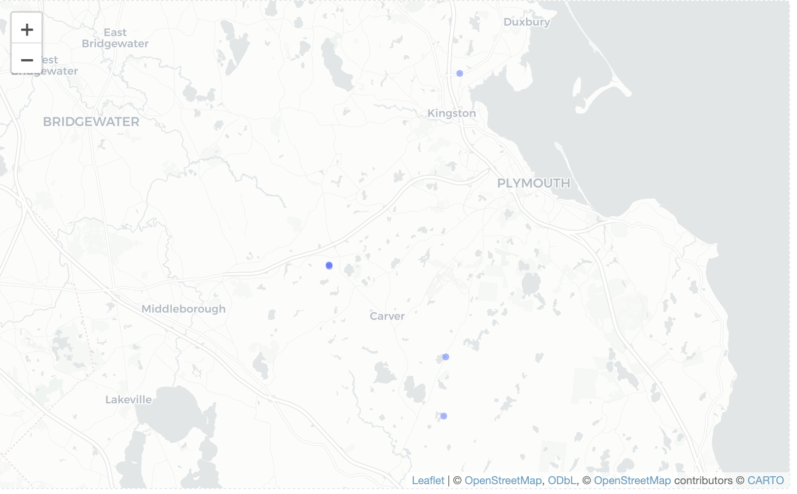
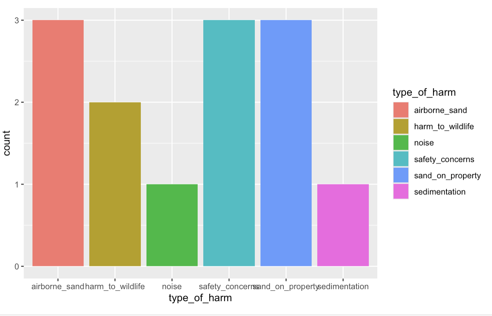

---
title: "| Data Science With an Eye Towards Sustainability    \n| P6: Narrowing Your Project Topic\n"
author: "Joe, Anna"
output:
  bookdown::html_document2:
    split_by: none
    toc: no
---

Each group should hand in one html document for the following exercises. Throughout the exercises, keep in mind that your research topics, questions, and data might evolve throughout the course of the project. This checkpoint is simply a first step in narrowing these down.

\

# Names & Workflow

List all group members. Discuss a plan for completing this assignment. How will you put together your shared Rmd? How will you divide the work? When will you meet to work on the assignment? Write this down in your Rmd.

Anna and Joe!!

In addition to class, we will have weekly meetings on Friday mornings :) 

Also, if you are using one, write down your GitHub repository.

-   We will be using GitHub: Solar-Incentive adoption (we will work in a subfolder)

-   Shared RMD/Project files will be set up as needed

-  Joe and Anna will split off and work on a data project using DJS JE data. 

\

# Topic & Research Questions

Following on the conversations you've already had in the preliminary brainstorming exercises, identify a common research topic of interest.

Specify two to three potential research questions that (1) are related to the topic above; and (2) you can (at least partially) answer using data.

My DJS team (just energy) is working with a community partner working for Environmental Justice in Southeastern Massachusetts. They are fighting earth extraction companies, who are emboldened to clear cut the globally rare pine barrens, and extract millions of cubic yards of soil, unregulated. Residents cannot leave the house without a mask on dust storm days, when the wind is blowing, find sand all over their properties, and face trucks driving dangerously on residential streets.  We will make a map for them. 

Our partner on sand mining: https://communitylandandwater.org/sand-and-gravel-mining/ 


Where is the concentration of sand data?
What conditions make people most likely to report data. 
Analyze response rate for different questions
Which harms are most commonly reported

# Connections to Sustainability

How are your research questions connected to sustainability? What are your personal learning goals related to sustainability for this project? You may wish to refer back to the [UN Sustainable Development Goals](https://sdgs.un.org/goals), the [Inner Development Goals](https://innerdevelopmentgoals.org/), and the [Engineering for One Planet](https://engineeringforoneplanet.org/wp-content/uploads/EOP_Framework_2023.pdf?), [Six Pillars of Climate Justice](https://centerclimatejustice.universityofcalifornia.edu/what-is-climate-justice/), and [Just Transition Principles](https://climatejusticealliance.org/just-transition/) frameworks. As a team, what sustainability background, analysis, and storytelling do you want to include in the scope of your project and in your final artifacts?


`#7 affordable and clean energy  
<<<<<<< HEAD
and the consequences this solar siting may have for establishing a "just" energy transition. 

# 3 good health and wellbeing

# 12 responsible consumption and production 

# 6 Clean Air and Water. 

#10 reduced inequalities - Furthermore, it is important because of the opportunity to make data more accessible to the public who is impacted by the sand mines. 


The connections with sustainability and health will be left to the reader to infer in their own format, we may include some information on sand mining on the website. 
This project has a couple of clear deliverables/ questions to answer, and beyond that a lot of flexibility. 
We would create a publicly accessible map of the impacts
A public and searchable database of the impacts for residents and supporters to access. 
Beyond that, any questions you are curious about. 
Eg. We could look at the correlation between historic weather trends and sand events. 

=======
>>>>>>> 752b0dcfe9af4782792e30e035819a18ad6d98f1


# Data

Identify the data sets you will use to explore the research questions above. These data sets may already be in csv form, you may acquire them (e.g., scraped with rvest, via public API, or from an SQL database), or you may plan on collecting some extra data. For each data set, summarize the following:


The Community Land and Water Coalition (our partner) has been running a qualitative data campaign to collect testimonies from residents about the harmful impacts of sand mining on their lives. This includes harmful events, the location, time of day, etc.  We will use this data!

The dataset is currently small, but will be updated soon with data entry. There are 40 columns of questions. 

Will join with location data. 
Potentially with a map of active sand mines in SE mass. 


-   data source
-   data description - what's being measured?
-   data limitations (eg: are the data recent? do they contain all variables you might want?)
-   data dimensions - how much data do you have?
-   how might the data be joined with other data you have?

\

# Research Question 1

Restate research question 1. Construct 1-2 relevant visualizations that provide insight on / help answer this question and piece these together to tell a short story. For each visualization, 1-2 sentences will suffice.

Where do sand complaints typically come from?

```{r}


```


What are the most common types of complaints

```{r}


```


# Next Steps

Identify next steps in your analysis. Do you need additional data? Do you need to do more cleaning or wrangling? How might you narrow your research questions/hypotheses? What additional visualizations would be helpful?

Complete data entry to increase size of the data
Preliminary cleaning and identifying long term strategy to make google form based dataframe usable in R
Exploratory data analysis with main dataset and comparisons to air quality monitoring data
\

# Contributions

Summarize each group member's specific contributions to this checkpoint assignment.

Anna provided the data and did a large amount of pre-cleaning, including projet proposal work. 
Together we ideated on narrower research questions and ideas for initial figures.

